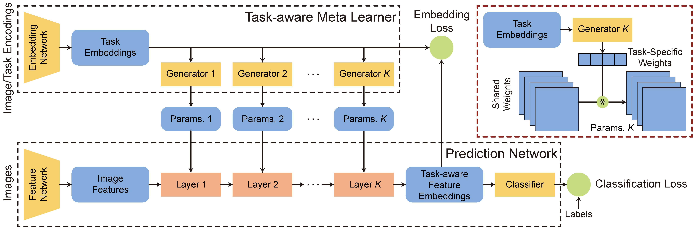

# TAFE-Net

This is the PyTorch Implementation for our paper: 

TAFE-Net: Task-aware Feature Embeddings for Low Shot Learning (CVPR 2019)

[Xin Wang](https://people.eecs.berkeley.edu/~xinw/), [Fisher Yu](https://www.yf.io/), Ruth Wang, [Trevor Darrell](https://people.eecs.berkeley.edu/~trevor/), [Joseph E. Gonzalez](https://people.eecs.berkeley.edu/~jegonzal/)

ArXiv link: [https://arxiv.org/abs/1904.05967](https://arxiv.org/abs/1904.05967)

**Abstract** 

Learning good feature embeddings for images often requires substantial training data. As a consequence, 
in settings where training data is limited (e.g., few-shot and zero-shot learning), we are typically forced 
to use a generic feature embedding across various tasks. Ideally, we want to construct feature embeddings 
that are tuned for the given task. In this work, we propose Task-Aware Feature Embedding Networks (TAFE-Nets) 
to learn how to adapt the image representation to a new task in a meta learning fashion. Our network is composed 
of a meta learner and a prediction network. Based on a task input, the meta learner generates parameters for the 
feature layers in the prediction network so that the feature embedding can be accurately adjusted for that task. 
We show that TAFE-Net is highly effective in generalizing to new tasks or concepts and evaluate the TAFE-Net on 
a range of benchmarks in zero-shot and few-shot learning. Our model matches or exceeds the state-of-the-art on 
all tasks. In particular, our approach improves the prediction accuracy of unseen attribute-object pairs by 4 
to 15 points on the challenging visual attribute-object composition task.




## Requirements
- Pytorch (>0.4.0, tested on Pytorch 1.1.0)
- Scipy


## Compositional Zero-shot Learning (attribute-object composition)

For the compositional zero-shot learning task, we are given a set of images and 
lists of attributes and objects. During training, only images of a subset of 
attribute-object composition are available. For testing, the model is tested
on images of unseen (novel) attribute-object composition. We evaluate TAFE-Net
on two datasets, MIT-States and StanfordVRD. For StanfordVRD, instead of 
attribute-object pairs, we instead use the subject-predicate-object(SPO) 
triplet as one composition.  

#### Data Statistics

Dataset | Mode | Num_Compositions | Num_Images 
-- | -- | -- | -- 
MIT-States | Train | 1292 | 34K
MIT-States | Test  | 700  | 19K
StanfordVRD | Train | 6672 | - 
StanfordVRD  | Test  | 1029 | 1000

Download the processed features and labels from 
[here](https://drive.google.com/open?id=1rV8LYZ2h8aEdaJwzxfn1U-JVdMpOlkwT) and save the data
to `data/compositional-zs`. 

In the original paper, we evaluate the model with ResNet-101 as the feature
extractor and in the recent paper [Task-aware Deep Sampling](https://arxiv.org/pdf/1906.04854.pdf), there are 
benchmark results of TAFE-Net with other backbones: `ResNet-18`, `DLA-34`
and `DLA-102`. 

Dataset | Model | ResNet-18 @Top1 (%) | ResNet-101 @Top1 (%) | 
DLA-34 @Top1 (%) | DLA-102 @Top1 (%)
-- | -- | -- | -- | -- | --
MIT-States | RedWine[1] | 12.0 | 17.4 | 14.6 | 17.0 
MIT-States | AttOperator[2] | 14.2 | 15.7 | 14.4 | 15.8
MIT-States | **TAFE-Net**| 15.1 | 17.2 | 16.1 | 17.0 
StanfordVRD | RedWine[1] | 8.3 | 10.1 | 9.5 | 9.8 
StanfordVRD | AttOperator[2] | 8.0 | 11.5 | 7.9 | 10.8 
StanfordVRD | **TAFE-Net**| 10.4 | 12.3 | 10.4 | 12.7

To train the model, you can simply run
```angular2html
python3 -m compositional-zs.train_compose --cmd train --arch [ARCH] -cfg [ConfigName]
```
For testing, 
```angular2html
python3 -m compositional-zs.train_compose --cmd test --resume [CheckpointPath]
```

To further simplify the procedure, you can write the configurations in 
`configs.json`. Some benchmark configs are already provided in `configs.josn`.
You can just launch the job by specifying the configuration name as follows
```angular2html
python launch.py [ConfigName]
```

## Zero-shot Learning 

We evaluate TAFE-Net on five benchmark datasets: AWA1, AWA2, aPY, CUB and SUN. 
You can download the processed data [here](https://drive.google.com/open?id=1cOU8W2Za5TfpXzoCqV06gLEagvt7HXIQ) and save it to `data/zero-shot`. 
The processed data is originally from [3]. 

We provide benchmark results on both classic zero-shot learning (ZSL) and 
generalized zero-shot learning (GZSL) as follows. 

For classic zer-shot learning (ZSL), 

Method| SUN | CUB | AWA1 | AWA2 | aPY 
--    | --  | --  | --   | --   | --  
LATEM | 55.3 | 49.3 | 55.1 | 55.8 | 35.2 
ALE   | 58.1 | 54.9 | 59.9 | 62.5 | 39.7 
DeViSE | 56.5 | 52 | 54.2 | 59.7 | 39.8 
SJE | 53.7 | 53.9 | 65.6 | 61.9 | 32.9 
ESZSL | 54.5 | 53.9 | 58.2 | 58.6 | 38.3
SYNC | 56.3 | 55.6 | 54.0 | 46.6 | 23.9
RelationNet | - | 55.6 | 68.2 | 64.2 | -
DEM | 61.9 | 51.7 | 68.4 | 67.1 | 35.0 
f-CLSWGAN* | 60.8 | 57.3 | 68.2 | - | -
SE*     | **63.4**| **59.6** | 69.5 | 69.2 | -
SP-AEN*    | 59.2 | 55.4 | - | 58.5 | 24.1  
**TAFE-Net**   | 60.9 | 56.9 | **70.8** | **69.3** | **42.3**

Models with `*` adopt synthetic features for training which could be 
considered as complementary approaches to our model as well as other discriminative models
without `*` presented in the table. 

For generalized zero-shot learning (GZSL), 

Method| SUN u | s | H  | CUB u | s | H |  AWA1 u | s | H |  AWA2 u | s | H |aPY u | s | H 
--    | --  | --  | --   | --  | -- |  --  | --  | --   | --   | --  | --  | --  | --   | --   | --  
LATEM| 14.7 | 28.8 | 19.5 |15.2 |57.3| 24.0| 7.3| 71.7| 13.3| 11.5| 77.3| 20.0| 0.1| 73.0 |0.2
ALE  | 21.8 | 33.1 |26.3 | 23.7 | 62.8| 34.4 | 16.8 | 76.1 | 27.5 | 14.0 | 81.8 | 23.9 | 4.6 | 73.7 | 8.7
DeViSE | 16.9 | 27.4 | 20.9 | 23.8 | 53.0 | 32.8 | 13.4 | 68.7 | 22.4 | 17.1 | 74.7 | 27.8 | 4.9 | 76.9 | 9.2
SJE | 14.7 | 80.5 | 19.8 | 23.5 | 59.2 | 33.6 | 11.3 | 74.6 | 19.6 | 8.0 | 73.9 | 14.4 | 3.7 | 55.7 | 6.9
ESZSL | 11.0 | 27.9 | 15.8 | 12.6 | 63.8 | 21.0 | 6.6 | 75.6 | 12.1 | 5.9 | 77.8 | 11.0 | 2.4 | 70.1 | 4.6
SYNC | 7.9 | 43.3 | 13.4 | 11.5 | 70.9 | 19.8 | 8.9 | 87.3 | 16.2 | 10.0 | 90.5 | 18.0 | 7.4 | 66.3 | 13.3
RelationNet | - | - | - | 38.1 | 61.1 | 47.0 | 31.4 | 91.3 | 46.7 | 30.0 | 93.4 | 45.3 | - | - | -
DEM | 61.9 |20.5 | 34.3 | 25.6 | 19.6 | 57.9 | 29.2 | 32.8 | 84.7 | 47.3 | 30.5 | 86.4 | 45.1 | 11.1 | 75.1 | 19.4
f-CLSWGAN* | 42.6 | 36.6 | **39.4** | 57.7 | 43.7 | **49.7** | 61.4 | 57.9 | 59.6 | - | - | - |- | - | -
SE*     | 40.9 | 30.5 | 34.9 | 53.3 | 41.5 | 46.7 | 67.8 | 56.3 | 61.5 | 58.3 | 68.1 | **62.8** | - | - | -
SP-AEN*  | 24.9 | 38.6 | 30.3 | 34.7 | 70.6 | 46.6 | - | - | - | 23.3 | 90.9 | 37.1 60.9 | 56.9 | **70.8** | **69.3** | **42.3**
**TAFE-Net**  | 27.9 | 40.2  | 33.0 | 41.0 | 61.4 | 49.2 | 50.5 | 84.4 | **63.2** | 36.7 |90.6 | 52.2 | 24.3 | 75.4 | **36.8**

Similar as the compositional zero-shot one, you can train the model by
```angular2html
python3 -m zero-shot.train_zsl --cmd train --arch [ARCH] -cfg [ConfigName]
```
and test by 
```angular2html
python3 -m zero-shot.train_zsl --cmd test --resume [CheckpointPath]
```

Usually you can just launch the runs by specifying the `config name` in the `config.json` as
```angular2html
python launch.py [ConfigName]
```


### Citation
If you find the code useful in your project, please consider citing our paper 
```angular2html
@inproceedings{wang2019tafe,
  title={TAFE-Net: Task-Aware Feature Embeddings for Low Shot Learning},
  author={Wang, Xin and Yu, Fisher and Wang, Ruth and Darrell, Trevor and Gonzalez, Joseph E},
  booktitle={Proceedings of the IEEE Conference on Computer Vision and Pattern Recognition},
  pages={1831--1840},
  year={2019}
}
```

### Reference
[1] [From Red Wine to Red Tomato: Composition with Context](https://www.ri.cmu.edu/wp-content/uploads/2017/12/composing_cvpr17.pdf)

[2] [Attributes as Operators: Factorizing Unseen Attribute-Object Compositions](https://arxiv.org/abs/1803.09851)

[3] [
Zero-Shot Learning - A Comprehensive Evaluation of the Good, the Bad and the Ugly](https://arxiv.org/abs/1707.00600)

[4] [Low-shot Visual Recognition by Shrinking and Hallucinating Features](https://arxiv.org/abs/1606.02819)

[5] [A Closer Look at Few-shot Classification](https://github.com/wyharveychen/CloserLookFewShot)